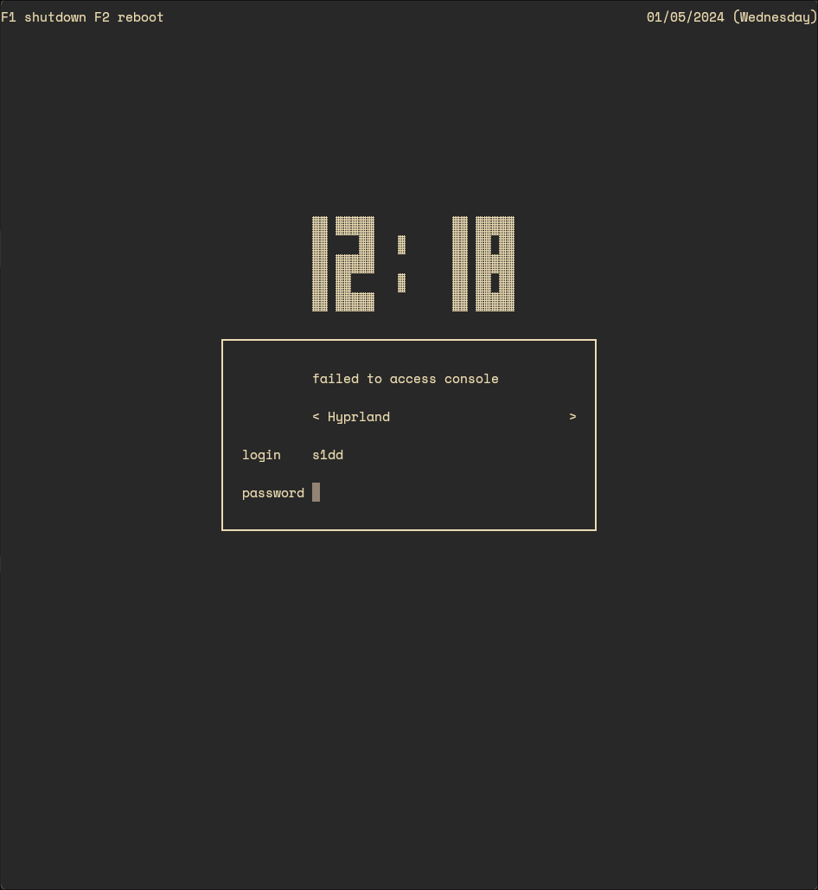

# LY

## It is a minial TUI login manager

This is how it looks in my terminal :

### NOTE: This will NOT replicate in actual TTY

## KEYNOTE:

1. To change font of tty (using terminus-font) :: `yay -S terminus-font` > `cd /usr/share/kbd/consolefonts` > `setfont ter-{X}.psfu.gz` > `sudo nano /etc/vconsole.conf` >> `in vconsole.conf add the following :: FONT=ter-{X}`
where {X} consists of the mutiple fonts given by terminus-font package (mine is `ter-222b` for example)

2. To change the background color of the tty to match your overall theme :: `sudo nano /lib/systemd/system/ly.service` > `add the following lines in [Service] :: ExecStartPre=/usr/bin/printf '%%b' '\e]P0{BG}\e]P7{FG}\ec'`

where {BG} is the hex code for background (mine is `282828`)
and {FG} is hex code for foreground (mine is `A6BF7E`)